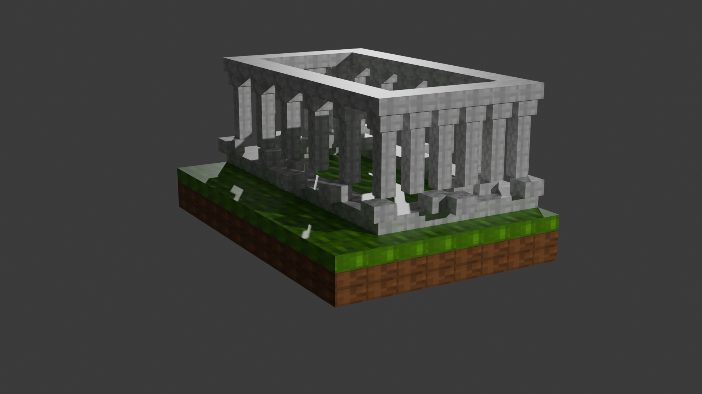

<div align="center">

# Minecraft Stone Structure

### Minecraft-inspired architectural structure created in Blender

</div>

---

## Preview

<p align="center">
  
</p>
<br>
<p align="center">
  <video src="Renders/Animation.mkv" type="video/x-matroska" controls>
  Your browser does not support the video tag.
</video> 
</p>

## Overview

This project is a Minecraft-inspired 3D structure modeled and rendered using Blender.

### Features

* Voxel-style architecture
* Custom stone detailing
* Textured terrain base
* Blender source file included

---

## Built With

<p align="center">
  
</p>

<p align="center">
  Blender
</p>

---

## Repository Structure

```text
Minecraft-Stone-Structure/

├── README.md
├── renders/
│   └── main-render.png
└── blender/
    └── minecraft.blend
```

---

## Files

| File            | Description            |
| --------------- | ---------------------- |
| minecraft.blend     | Blender source project |
| main-render.png | Final rendered image   |

---
